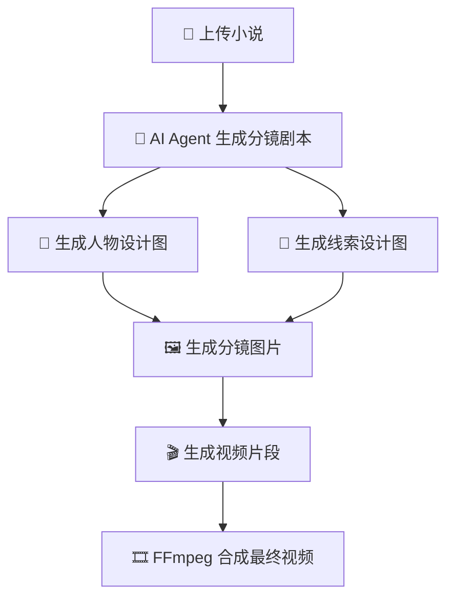
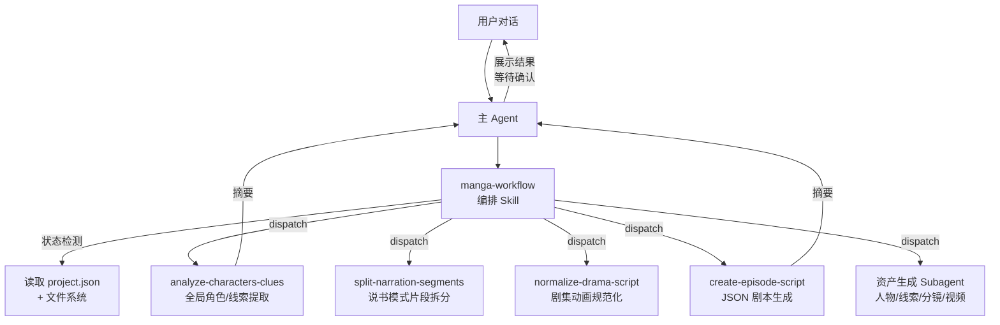
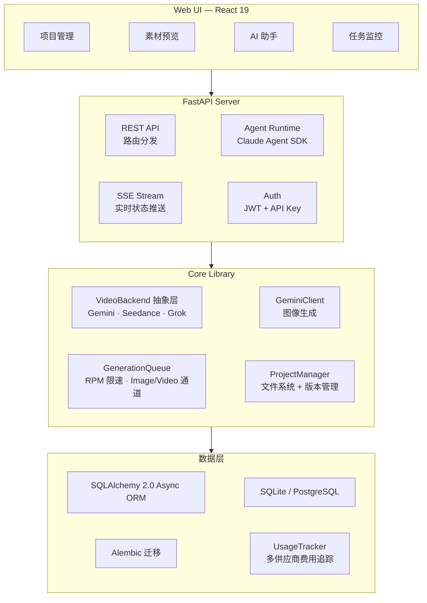

<h1 align="center">
  <br>
  <picture>
    <source media="(prefers-color-scheme: light)" srcset="frontend/public/android-chrome-maskable-512x512.png">
    <source media="(prefers-color-scheme: dark)" srcset="frontend/public/android-chrome-512x512.png">
    
  </picture>
  <br>
  ArcReel
  <br>
</h1>

<h4 align="center">开源 AI 视频生成工作台 — 从小说到短视频，全程 AI Agent 驱动</h4>
<h5 align="center">Open-source AI Video Generation Workspace — Novel to Short Video, Powered by AI Agents</h5>

<p align="center">
  <a href="#快速开始"></a>
  <a href="https://github.com/ArcReel/ArcReel/blob/main/LICENSE"></a>
  <a href="https://github.com/ArcReel/ArcReel"></a>
  <a href="https://github.com/ArcReel/ArcReel/pkgs/container/arcreel"></a>
</p>

<p align="center">
  
  
  
  
  
  
  
  
</p>

<p align="center">
  
</p>

---

## 核心能力

<table>
<tr>
<td width="20%" align="center">
<h3>🤖 AI Agent 工作流</h3>
基于 <strong>Claude Agent SDK</strong>，编排 Skill + 聚焦 Subagent 多智能体协作，自动完成从剧本创作到视频合成的完整流水线
</td>
<td width="20%" align="center">
<h3>🎨 Nano Banana 2 图像生成</h3>
Gemini 最新图像模型驱动，人物设计图确保角色一致性，线索追踪保证道具/场景跨镜连贯
</td>
<td width="20%" align="center">
<h3>🎬 多供应商视频生成</h3>
支持 <strong>Veo 3.1</strong>、<strong>Seedance</strong>、<strong>Grok</strong> 三大视频供应商，可按视频项目切换
</td>
<td width="20%" align="center">
<h3>⚡ 异步任务队列</h3>
RPM 速率限制 + Image/Video 独立并发通道，lease-based 调度，支持断点续传
</td>
<td width="20%" align="center">
<h3>🖥️ 可视化工作台</h3>
Web UI 管理项目、预览素材、版本回滚、实时 SSE 任务追踪，内置 AI 助手
</td>
</tr>
</table>

## 工作流程



## 功能特性

- **完整生产流水线** — 小说 → 剧本 → 人物设计 → 分镜图片 → 视频片段 → 成片，一键编排
- **多智能体架构** — 编排 Skill 检测项目状态并自动调度聚焦 Subagent，每个 Subagent 独立完成一项任务后返回摘要
- **多视频供应商** — 支持 Gemini (Veo 3.1)、Seedance 1.5 (火山方舟)、Grok (xAI) 三大视频生成后端，全局/视频项目级可切换
- **两种内容模式** — 说书模式（narration）按朗读节奏拆分片段，剧集动画模式（drama）按场景/对话结构组织
- **渐进式分集规划** — 人机协作切分长篇小说：peek 脚本探测切分点上下文 → Agent 建议自然断点 → 用户确认 → 物理切分为单集文件，按需制作、无需一次规划全部集数
- **风格参考图** — 上传一张风格图，AI 自动分析生成风格描述，后续所有内容生成（人物/线索/分镜）统一使用该风格，确保全项目视觉一致
- **人物一致性** — AI 先生成人物设计图，后续所有分镜和视频均参考该设计
- **场景连贯** — 分镜图自动参考上一张生成，确保相邻场景画面衔接自然
- **线索追踪** — 关键道具、场景元素标记为"线索"，跨镜头保持视觉连贯
- **版本历史** — 每次重新生成自动保存历史版本，支持一键回滚
- **多供应商费用追踪** — 按供应商分策略计费（Gemini 按分辨率×时长 USD、Seedance 按 token 用量 CNY、Grok 按秒 USD），不同币种分别统计
- **用户认证** — JWT 登录 + API Key 认证双模式，支持外部平台集成
- **OpenClaw 集成** — 提供 AgentSkill 定义文件与同步对话端点，可通过 OpenClaw 等外部 AI Agent 平台调用 ArcReel 能力
- **项目导入/导出** — 整个项目打包归档，方便备份和迁移
- **竖屏优化** — 默认 9:16 比例，适合短视频平台发布

## 快速开始

### 默认部署（SQLite）

```bash
# 1. 克隆项目
git clone https://github.com/ArcReel/ArcReel.git
cd ArcReel/deploy

# 2. 配置环境变量
cp .env.example .env

# 3. 启动服务
docker compose up -d

# 访问 http://localhost:1241
```

### 生产部署（PostgreSQL）

```bash
cd ArcReel/deploy/production

# 配置环境变量（需设置 POSTGRES_PASSWORD）
cp .env.example .env

docker compose up -d
```

首次启动后，前往 **设置页**（`/settings`）完成以下配置即可开始使用：

1. **ArcReel 智能体** — 配置 Anthropic API Key（驱动 AI 助手）
2. **AI 生图/生视频** — 配置至少一个视频供应商的 API Key（Gemini / Seedance / Grok）

> **部署提示**：若使用 Seedance（火山方舟）作为视频供应商，部署环境必须公网可访问，因为 Seedance 图片上传需要通过公网地址访问。需在 `.env` 中配置 `FILE_SERVICE_BASE_URL`。

## 视频供应商

ArcReel 通过统一的 `VideoBackend` 协议，支持多个视频生成供应商，可在全局或项目级别切换：

| 供应商 | 模型 | 能力 | 计费方式 |
|--------|------|------|----------|
| **Gemini** (Google) | Veo 3.1 | 文生视频、图生视频、视频延展、负面提示词 | 按分辨率 × 时长查表 (USD) |
| **Seedance** (火山方舟) | Seedance 1.5 Pro | 文生视频、图生视频、音频生成、种子控制、离线推理 | 按 token 用量 (CNY) |
| **Grok** (xAI) | grok-imagine-video | 文生视频、图生视频 | 按秒计费 (USD) |

供应商选择优先级：项目级设置 > 全局默认。切换供应商时通用设置（分辨率、宽高比、音频等）直接沿用，供应商特有参数保留。

## AI 助手架构

ArcReel 的 AI 助手基于 Claude Agent SDK 构建，采用**编排 Skill + 聚焦 Subagent** 的多智能体架构：



**核心设计原则**：

- **编排 Skill（manga-workflow）** — 具备状态检测能力，自动判断项目当前阶段（角色设计 / 分集规划 / 预处理 / 剧本生成 / 资产生成），dispatch 对应的 Subagent，支持从任意阶段进入和中断恢复
- **聚焦 Subagent** — 每个 Subagent 只完成一项任务后返回，小说原文等大量上下文留在 Subagent 内部，主 Agent 只收到精炼摘要，保护上下文空间
- **Skill vs Subagent 边界** — Skill 负责确定性脚本执行（API 调用、文件生成），Subagent 负责需要推理分析的任务（角色提取、剧本规范化）
- **阶段间确认** — 每个 Subagent 返回后，主 Agent 向用户展示结果摘要并等待确认，确认后才进入下一阶段

## OpenClaw 集成

ArcReel 支持通过 [OpenClaw](https://openclaw.ai) 等外部 AI Agent 平台调用，实现自然语言驱动的视频创作：

1. 在 ArcReel 设置页生成 API Key（`arc-` 前缀）
2. 在 OpenClaw 中加载 ArcReel 的 Skill 定义（访问 `http://your-domain/skill.md` 自动获取）
3. 通过 OpenClaw 对话即可创建项目、生成剧本、制作视频

技术实现：API Key 认证（Bearer Token）+ 同步 Agent 对话端点（`POST /api/v1/agent/chat`），内部对接 SSE 流式助手并收集完整响应返回。

## 使用方式

通过 Web UI 工作台完成所有操作：

- **项目管理** — 创建项目、上传小说、管理多剧集
- **AI 助手** — 内置 AI 助手，对话式引导完成剧本创作、人物设计、分集规划等
- **分集规划** — 长篇小说渐进式切分：peek 探测 → Agent 建议断点 → 用户确认 → 物理切分
- **风格参考图** — 上传风格图 → AI 自动分析生成风格描述 → 统一应用到所有图片生成
- **素材预览** — 人物图、分镜图、视频片段全屏预览
- **任务监控** — 实时查看生成任务进度（SSE 推送）
- **版本管理** — 每次重新生成自动保存历史，支持一键回滚
- **费用统计** — 按供应商、按任务类型精确统计 API 调用费用
- **参数配置** — 供应商管理、API Key、模型选择、速率限制等均可在页面配置

## 技术架构



## 技术栈

| 层级 | 技术 |
|------|------|
| **前端** | React 19, TypeScript, Tailwind CSS 4, wouter, zustand, Framer Motion, Vite |
| **后端** | FastAPI, Python 3.12+, uvicorn, Pydantic 2 |
| **AI 智能体** | Claude Agent SDK (Skill + Subagent 多智能体架构) |
| **图像生成** | Google Gemini API (Nano Banana 2) |
| **视频生成** | Google Veo 3.1 (`google-genai`), Seedance 1.5 (`volcengine-python-sdk[ark]`), Grok (`xai-sdk`) |
| **媒体处理** | FFmpeg, Pillow |
| **ORM & 数据库** | SQLAlchemy 2.0 (async), Alembic, aiosqlite, asyncpg — SQLite (默认) / PostgreSQL (生产) |
| **认证** | JWT (`pyjwt`), API Key (SHA-256 哈希), Argon2 密码哈希 (`pwdlib`) |
| **部署** | Docker, Docker Compose（`deploy/` 默认, `deploy/production/` 含 PostgreSQL） |

## 文档

- 📖 [完整入门教程](docs/getting-started.md) — 从零开始的手把手指南
- 💰 [Google GenAI 费用说明](docs/Google视频&图片生成费用参考.md) — API 调用费用参考

## 贡献

欢迎贡献代码、报告 Bug 或提出功能建议！

### 本地开发环境

```bash
# 前置要求：Python 3.12+, Node.js 20+, uv, pnpm, ffmpeg

# 安装依赖
uv sync
cd frontend && pnpm install && cd ..

# 初始化数据库
uv run alembic upgrade head

# 启动后端 (终端 1)
uv run uvicorn server.app:app --reload --port 1241

# 启动前端 (终端 2)
cd frontend && pnpm dev

# 访问 http://localhost:5173
```

### 运行测试

```bash
# 后端测试
python -m pytest

# 前端类型检查 + 测试
cd frontend && pnpm check
```

## 许可证

[AGPL-3.0](LICENSE)

---

<p align="center">
  如果觉得项目有用，请给个 ⭐ Star 支持一下！
</p>